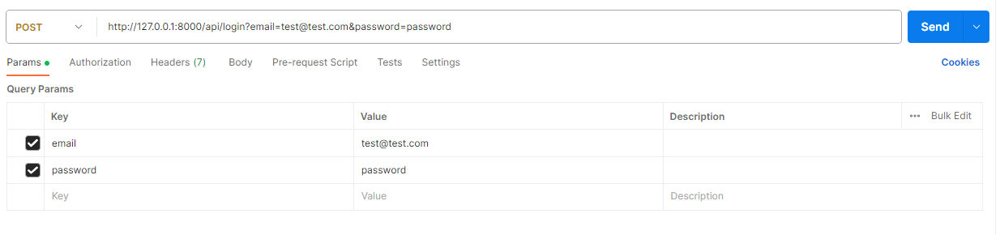
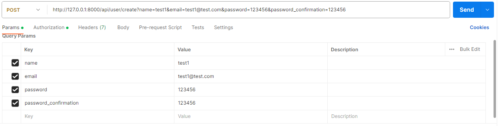
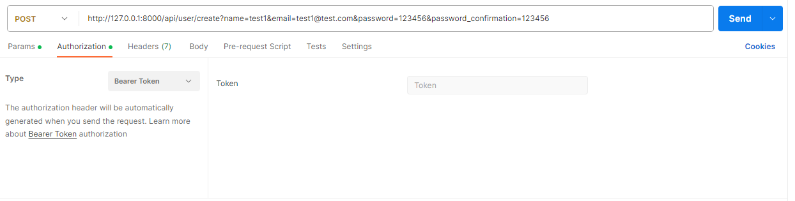
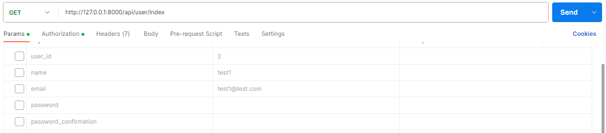
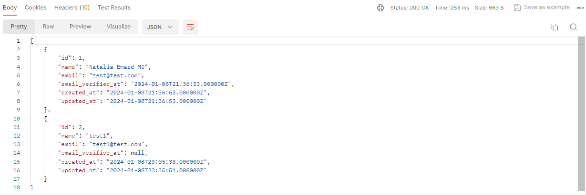
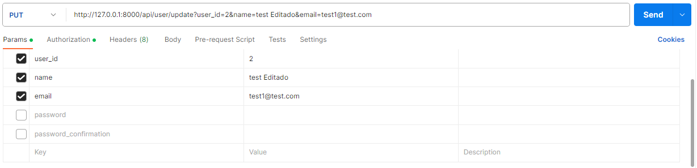
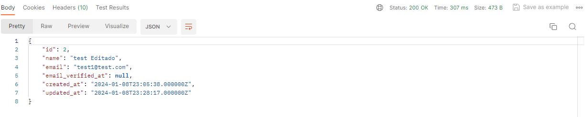
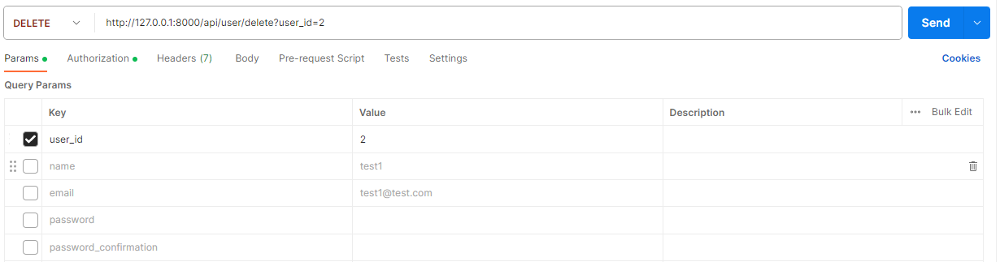
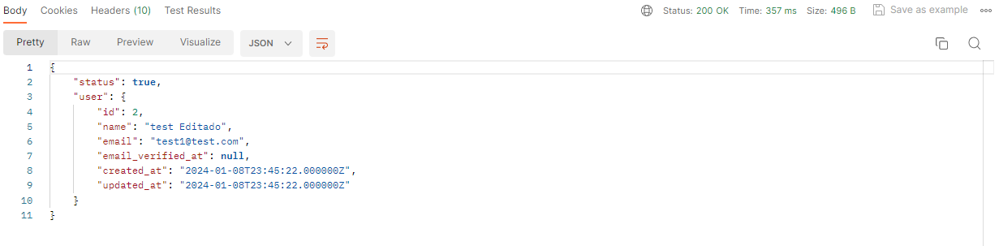
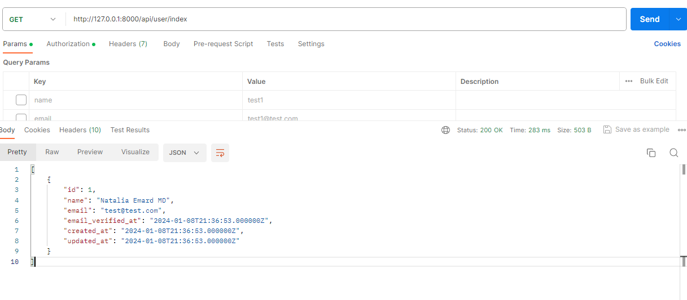

# Laravel API RESTful

Un proyecto Apirestful sencillo que consiste en la creación de una API (Interfaz de Programación de Aplicaciones) siguiendo los principios de arquitectura REST (Transferencia de Estado Representacional). Esta API permite la comunicación y transferencia de datos entre diferentes aplicaciones de manera eficiente y escalable. Utilizando métodos HTTP estándar (como GET, POST, PUT, DELETE), la API proporcionaría acceso a recursos específicos mediante endpoints bien definidos. La implementación se centra en la simplicidad y la facilidad de uso, brindando funcionalidades básicas para la manipulación de datos a través de solicitudes HTTP.

## Pre-Requisitos

- Sistema operativo Window 10
- Postman for Windows Version 10.21.11
- Xampp Version 3.3.0
- MySQL Version 8.0.2
- Laravel Framework 9.52.16
- Visual Studio Code
- Composer version 2.4.4

## Instalación

Clonar repositorio 
```bash
git clone https://github.com/WillianAbrego/ApiRESTFul.git
```
Ingresar al folder
```bash
cd ApiRESTFul
```
Abrir con visual studio code
```bash
code .
```

Actualizar composer 
```bash
composer install or composer update
```
Copiar archivo .env.example y renombrarlo como .env
```bash
cp .env.example .env
```
Realizar las siguientes configuraciones en archivo .env
 ```
 DB_CONNECTION=mysql
DB_HOST=127.0.0.1
DB_PORT=3306
DB_DATABASE={name_db}
DB_USERNAME={user_db}
DB_PASSWORD={pass_db}
 ```
 ```bash
php artisan key:generate
```
***
Reiniciar la base de datos de la aplicación Laravel
```bash
php artisan migrate:fresh --seed
```

## Instrucciones para Pruebas
Abrir postman para poder realizar las pruebas de los endpoint, ingresar a http://127.0.0.1:8000/api/login e ingresar las credenciales que se crearon cuando ejecuto la migracion.

- email => test@test.com
- password => password

| |
|---|

Se le presentara un token en la respuesta, dicho token sera de utilidad para poder interactuar con el sistema.

***
# Creación de un usuario
 ```bash
  POST /api/create
 ```

 Es necesario ir a la pestaña de Authorization y colocar el token que anteriormente fue creado, el resultado que tendra sera un json con los datos que fueron ingresados.

| ||
|---|---|

# Listar usuarios
Muestra los usuarios ingresados
```bash
GET /api/user/index
```
|Ingreso|Salida|
|---|---|
|||

# Edicion de usuario

```bash
PUT /api/user/update
```

Es necesario agregar el id del usuario que se quiere editar junto a los parametros que quiere modificar

|Ingreso|Salida|
|---|---|
|||

# Eliminacion de usuario

```bash
DELETE /api/user/delete
```

Es necesario agregar el id del usuario que se quiere eliminar, y luego listar los usarios para comprobar que la eliminacion sea correcta

|Ingreso|Salida|Revision|
|---|---|---|
||| |

